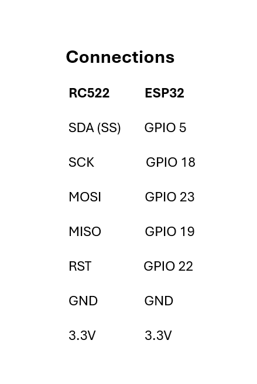
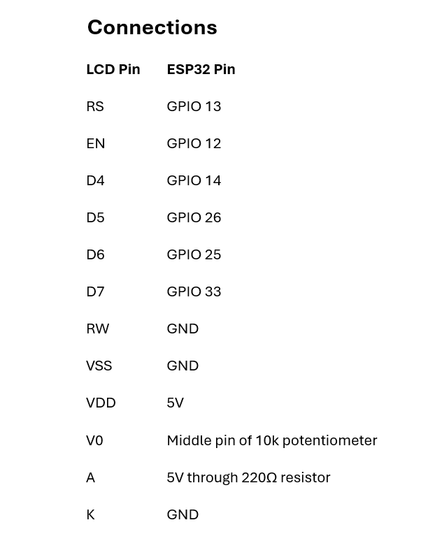
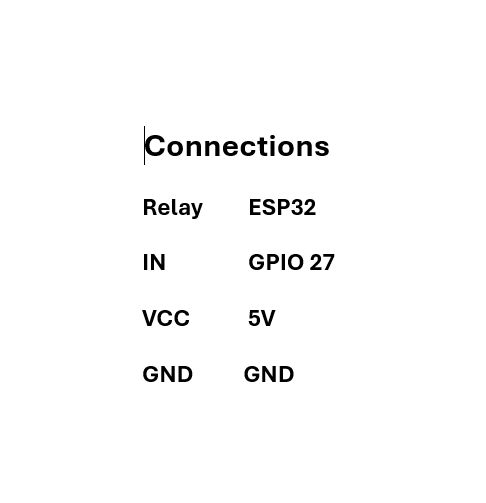

# ESP32-RFID-Access-Control-System
An RFID-based access control system using ESP32 and RC522 RFID reader. Authorized users are granted access through a relay-controlled door lock and automatically relocks after 5 seconds. while unauthorized users are denied. Status messages are displayed on a 16×2 LCD.

## Components Used

* ESP32
* RC522 RFID Reader
* 16×2 LCD
* Relay Module

## Features

* RFID-based authentication
* Access Granted/Denied indication
* Relay-controlled door lock
* LCD status display
* Automatic relocking after 5 seconds

## Software Used

* Arduino IDE
* MFRC522 Library
* LiquidCrystal Library

* ## Connection Diagrams

### RC522 to ESP32

### LCD to ESP32

### Relay to ESP32

## Working Demonstration

### Scan New Card

### Getting UID Number

### Card Scanning

### Access Granted

### Access Denied

## Author

Sajindas M

